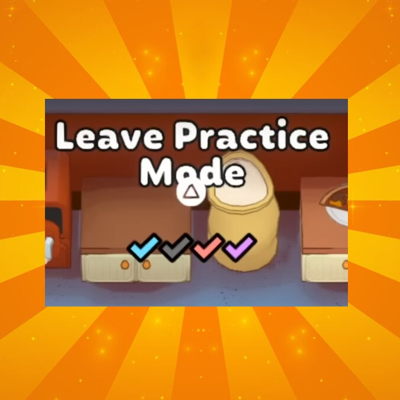

# PlateUp-ForceConsent

Mod for the PC Game 'PlateUp!'

View on the Steam Workshop: https://steamcommunity.com/sharedfiles/filedetails/?id=3238138908

## Force Consent

Are you always waiting for your friends to press accept when you just want to set one smart grabber or leave practice mode? The same guy is always afk or sleeping? Dont worry, just install "**Force Consent**", and wait no more!

## Features

- Auto accepts votes for Join/Leave Practice Mode when at least one person presses ready.
- Auto accept loading a savegame from the lobby if the host presses ready.
  Only the host needs this mod to work.

## Future Updates

Maybe adding the same logic as the savegame loading to other votes, but it might not always be intended and could be missclicked (e.g. abandoning a game). Let me know what you think!
